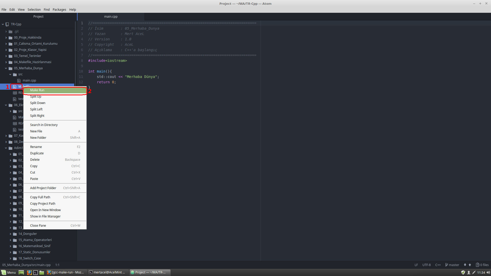

# Çalışma Ortamı

* ### Hangi İşletim Sistemi Kullanıyoruz
Biz geliştirmeleri **"Linux Mint 18.3 Sylvia"** işletim sisteminde gerçekleştiriyoruz. İndirmek için;

  > https://linuxmint.com/edition.php?id=246

* ### Sistem Gereksinimleri
Cihazınıza bazı indirmeniz gereken programlar bulunmaktadır. Bunları indirmek için terminal ekranınızda aşağıdaki komutları çalıştırınız.

 ``` bash
sudo apt-get install g++ -y
sudo apt-get install build-essential -y
sudo apt-get install git -y
sudo apt-get install make -y
sudo apt-get install xterm -y
```


* ### IDE Nedir ?
**IDE** kısaltmasının açılmış hali **"Integrated Development Environment"** demektir. Türkçe çevirisi **"Entegre Geliştirme Ortamı"** dır.

  Aslında **IDE** bizim **yazılım projelerimizi**, rahat **programlayabilmek** için bir çok imkan sağlayan **geliştirme ortamıdır**. **Renklendirme, otomatik düzenleme, hata denetimi gerçekleştirme, derleme, çalıştırma, fonksiyonlar ve sınıflar arası gezinme** gibi bir çok kolaylıklar sağlamaktadır.

  Proje ne kadar büyük ve karmaşıksa, **IDE** gereksinimi o kadar artmaktadır.  

* ### Hangi IDE'leri Kullanabiliriz
**C++** için bir çok **IDE** seçeneği bulunmaktadır. Bunlardan en çok kullanılanları;

  #### Netbeans;
  > https://netbeans.org/features/cpp/index.html  

  #### Clion (Ücretli);
  > https://www.jetbrains.com/clion/

  #### Visual Code ;
  > https://code.visualstudio.com/

  #### Eclipse
  > https://www.eclipse.org/downloads/packages/eclipse-ide-cc-developers/oxygen3a

  #### Atom
  > https://atom.io

  #### Code::Blocks
  > http://www.codeblocks.org/

  #### Codelite
  > https://codelite.org/

* ### Biz Hangi IDE de Kod Geliştirdik, Neden?
Biz kodlarımızı **"Açık Kaynak"** **(Open Source)** olan **"ATOM"** da geliştirdk. Bunun amacı, çoğu **IDE** de olduğu gibi otomatik bazı işleri **yapmıyor** oluşu. Yani program sırasında otomatik bazı dosyaları oluşturmuyor. Yada arka planda kolaylıklar **sağlamıyor**. **İlk öğrenme sırasında** otomatik olan işlemler, belki bazı konuları kavramada zorluk yaşatabilir. Fakat siz gönlünüzden hangi ortamda kod yazmak istiyorsanız onu seçebilirsiniz. Hatta hiç **IDE** kullanmadan, basit bir **text editöründe** dahi programlayabilirsiniz.

* ### Nasıl Yüklenir
İlk adım olarak terminalden aşağıdaki kodları çalıştırarak **"ATOM"** editörü indirip kuruyoruz.
``` bash
wget https://atom.io/download/deb atom-amd64.deb -O atom-amd64.deb
sudo dpkg -i atom-amd64.deb
```

  **"ATOM"** bir çok programlama dili için eklentiler sağlamaktadır. Bizde **"C++"** için bir eklenti kullanacağız.

  ##### Adım 1 :
  **Welcome Guide** ekranından **Install a Package** kısmına giriş yapıyoruz.
  

  ##### Adım 2 :
  Gelen ekranda **Open Installer** kısmına giriş yapıyoruz.
  

  ##### Adım 3 :
  Açılan ekranda arama kısmına **GCC Make Run Package** yazıp **Enter** tuşuna basıyoruz ve gelen paketi **Install** komutu ile yüklemesini gerçekleştiriyoruz.
  

  ##### Adım 4
  Kullanmak için, projelerde bulunan **Makefile** dosyasının üstüne **Mouse**'un sağ tuşuna bastığımzda **Make Run** komutu gelmekte. Ona tıklayınca projemizi çalıştırmış oluyoruz.
  
